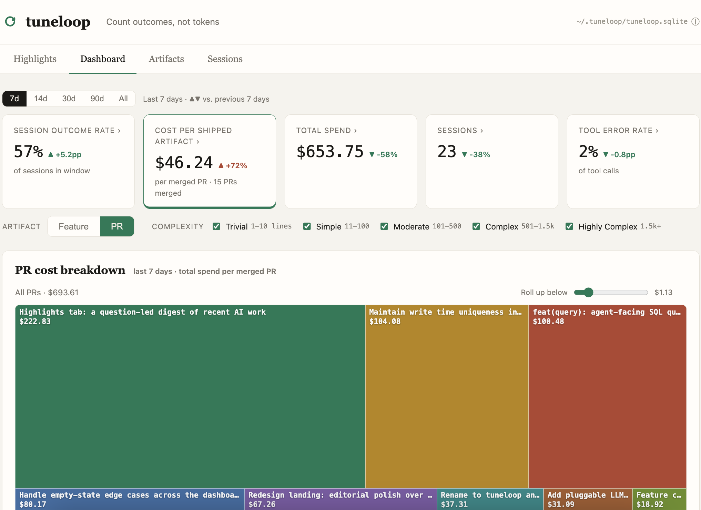
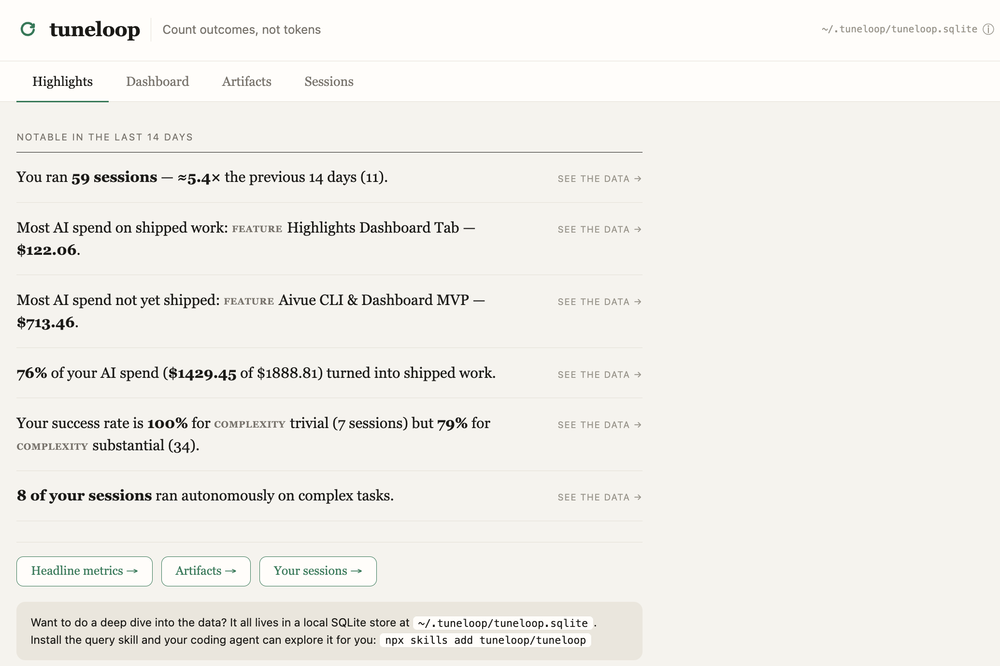
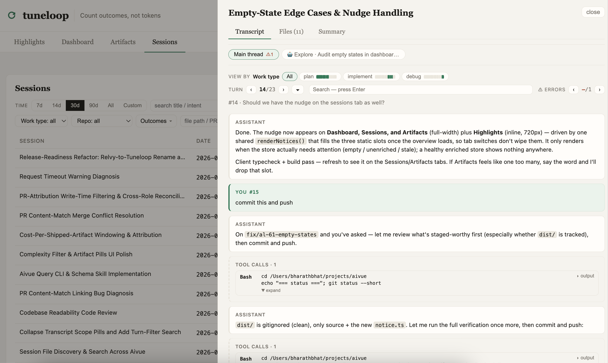

# tuneloop

Local analytics for your AI coding sessions. **Count outcomes, not tokens.**

<p align="center">
  
</p>

**tuneloop** turns the session transcripts your AI coding tools already write into
a local dashboard of what you actually shipped, what it cost, and your work
patterns. Concretely, it enriches each session with:

- **Outcome links** — merged PRs, features shipped, files changed
- **Granular cost attribution to outcomes** — Sometimes the whole session is
  scoped to a single piece of work, and sometimes you may have a long session
  where you work on multiple things. tuneloop attributes cost to each
  appropriately. (Example: Turns 1-4 were about PR #2, rest were PR #4)
- **Task complexity**
- **Agent autonomy**
- **Work type** — plan, implementation, debugging, …
- **Tool error categories**

Combined with the data already in the transcript — model, agent harness, repo, and
more — this data lets you answer questions like:

- How much of my AI spend went into PR #2, or feature *X*?
- Are my agents getting more autonomous over time on complex tasks?
- What's my success rate on repo *X* vs. repo *Y* — or any other dimension you care about?

Works with **Claude Code**, **Codex**, and **OpenCode**. Everything runs and stays
on your machine; enrichments that need an LLM can use your own provider key or a
local model. The built-ins above are just the defaults — tuneloop is extensible,
and adding your own enrichment is straightforward.

> Built by the team at [Tuneloop](https://tuneloop.io).

## Quick start

```bash
npx tuneloop analyze
```

This scans typical session folders like `~/.claude/projects`, builds a local
store, and prints a summary. The **first run** processes every transcript, so
expect a few minutes (around 4 for ~80 sessions with [LLM
enrichment](#llm-enrichment) on; static-only runs are faster); later runs are
incremental and only re-process sessions that changed, so they finish quickly. On completion the
CLI prints the dashboard URL — press **Enter** to open it in your browser
(`Ctrl+C` to stop). Point it at other locations with a comma-separated list:

```bash
npx tuneloop analyze ~/.claude/projects,/path/to/more/sessions
```

Handy flags:

- `--no-serve` — build the store and exit, no dashboard
- `--port <n>` — serve on a different port
- `npx tuneloop serve` — open the dashboard over an already-analyzed store, without re-analyzing

## What you get

The dashboard reads everything live from a local SQLite store:

- **Session outcome rate** — how many of your sessions ended in a win (you pick what counts).
- **Cost per shipped artifact** — dollars of AI spend per merged PR or per shipped feature.
- **Total spend** — over time, split by model, work type, or repo.
- **Tool & skill usage** — call counts, error rates, and error categories across every session.
- A **filterable session viewer**, with the full transcript and file changes behind each one.
    - Easy transcript navigation (turn-by-turn, errors, free text search, and
      outcomes). For example: you can jump to the part of the session where
      you worked on a particular feature or code change.
    - Filter sessions that touched a particular file / PR / feature.

Cost, tools, files, and git/PR outcomes come from static analysis — no setup or
API key. Work type, complexity, autonomy, and feature names come from [LLM
enrichment](#llm-enrichment), which is worth setting up: much of what makes the
dashboard useful depends on it.

**Highlights** turns the same data into plain-English insights about your recent work:

<p align="center">
  
</p>

And every session is a readable transcript you can navigate turn-by-turn, by work
type, or by error — with the files it changed alongside:

<p align="center">
  
</p>

## How it works

**Enrichment** labels each session in one LLM call:

- **Work type** — one of `plan` · `implement` · `debug` · `research` · `review` · `docs` · `other`.
- **Complexity** — one of `trivial` · `routine` · `substantial` · `open-ended`.
- **Autonomy** — how much the agent drove itself: `autonomous` · `guided` · `minimal`.
- **Feature** — links the session to a shipped feature, reusing your existing feature
  names and proposing new ones. The taxonomy grows as you analyze, so related work
  lands under one feature instead of fragmenting.
- **Success** — a judged outcome (`success` / `partial` / `failure`), surfaced as the
  `session_success` outcome you can count.

**PR linking** connects a session to the PRs it produced, two ways:

- **Explicit** — the transcript shows the agent creating, merging, or reviewing a PR
  (`gh pr create` / `gh pr review` / a GitHub MCP tool); live status comes from your
  local `gh`.
- **Content-match** — for the common case where the agent writes the code and *you*
  commit and push it (no `gh pr create` in the transcript), tuneloop matches the lines
  the agent authored against your own PRs' diffs and links the best match.

See [ARCHITECTURE.md](./ARCHITECTURE.md#built-in-processors) for the detection rules.

**Block-level cost attribution** — a long session that touches several things isn't
billed as one lump. tuneloop splits it into blocks and attributes token cost per
block, so a per-PR or per-feature cost reflects only the work that went into it.
→ [how blocks work](./ARCHITECTURE.md#blocks-and-cost-attribution-srccoreblocksts)

**Metrics** — the five dashboard headlines (outcome rate, cost per shipped artifact,
total spend, sessions, tool error rate) are each explained in
[ARCHITECTURE.md](./ARCHITECTURE.md#the-metrics-explained).

## Query it from your coding agent

Everything on the dashboard is a query over the store — and so is anything it
*doesn't* show. `tuneloop query` runs read-only SQL over that store, straight from
your terminal or your coding agent's shell:

```bash
tuneloop query "SELECT model, SUM(cost_usd) FROM usage_facts GROUP BY 1 ORDER BY 2 DESC"
tuneloop query --schema    # tables, facets, and measures — learn the shape first
```

Only `SELECT` / `WITH … SELECT` run; writes and raw transcripts are off-limits.

Because it needs no server and speaks plain SQL, it's a natural fit for Claude Code
and other agents. Install the bundled skill so your agent knows the schema and the
grain rules before it writes a query:

```bash
npx skills add tuneloop/tuneloop
```

Then just ask — *"Query tuneloop: what did I spend per model last week?"* — and the agent writes
the SQL, runs it, and reads back the answer.

## LLM enrichment

To label each session with a work type, complexity, autonomy, and an LLM-judged
success signal — and to name the features you shipped — point tuneloop at **your
own** LLM key. Your session data goes only to the provider you choose:

```bash
export TUNELOOP_LLM_PROVIDER=anthropic
export ANTHROPIC_API_KEY=sk-ant-...
# optional: export TUNELOOP_LLM_MODEL=claude-haiku-4-5
npx tuneloop analyze
```

Pick a preset and supply its key; the model defaults sensibly and is overridable
with `TUNELOOP_LLM_MODEL` (or `--llm-model`). Anthropic and OpenAI are native;
everything else speaks the OpenAI-compatible API.

| `TUNELOOP_LLM_PROVIDER` | Key env | Notes |
|---|---|---|
| `anthropic` | `ANTHROPIC_API_KEY` | native |
| `openai` | `OPENAI_API_KEY` | native |
| `openrouter` | `OPENROUTER_API_KEY` | 400+ models via one key |
| `groq` | `GROQ_API_KEY` | fast; free tier |
| `deepseek` | `DEEPSEEK_API_KEY` | |
| `gemini` | `GEMINI_API_KEY` | Google, OpenAI-compatible endpoint |
| `together` / `fireworks` / `xai` | `TOGETHER_API_KEY` / `FIREWORKS_API_KEY` / `XAI_API_KEY` | |
| `ollama` | _(none)_ | local; `http://localhost:11434` |
| `openai-compatible` | `TUNELOOP_LLM_API_KEY` | any other host; set `TUNELOOP_LLM_BASE_URL` |

```bash
# A hosted provider — name it, never type a URL:
TUNELOOP_LLM_PROVIDER=openrouter OPENROUTER_API_KEY=sk-or-... \
  npx tuneloop analyze --llm-model deepseek/deepseek-chat

# Fully local, no key, nothing leaves your machine:
npx tuneloop analyze --llm-provider ollama --llm-model qwen2.5

# Any other OpenAI-compatible host:
TUNELOOP_LLM_PROVIDER=openai-compatible TUNELOOP_LLM_BASE_URL=https://host/v1 \
TUNELOOP_LLM_API_KEY=… npx tuneloop analyze --llm-model my-model
```

Enrichment is one structured **tool call** per session, so use a
tool-call-capable model (all the hosted defaults qualify). Flags override the env
for one run; the API key is always env-only. It's cheap — a typical corpus of ~80
sessions runs about **$0.60** with Claude Haiku. This cost shows up as **Analysis
spend** in the summary, priced from a built-in table with an OpenRouter public
price list filling gaps (cached under `~/.tuneloop/`).

**Local Ollama** needs a bigger context window and a capable model: the enrichment
prompt is ~4–6k tokens but Ollama's ~2k default silently truncates it, so start the
server with `OLLAMA_CONTEXT_LENGTH=8192 ollama serve` and use a tool-strong ≥7B
model like `qwen2.5:7b` (tiny models tool-call unreliably).

## Privacy

Transcripts are processed locally and results are written to a local SQLite store
(`~/.tuneloop/` by default). tuneloop never posts your **session data** anywhere —
the only thing that ever leaves is a transcript sent to the LLM provider whose key
you supply, and only if you enable enrichment. Its other network calls are
read-only and carry none of your data: your local `gh` for PR status and diffs
(your own GitHub auth), and OpenRouter's public price list to cost models the
built-in table doesn't know. To avoid sending transcripts off the machine at all,
enrich against a local model (`--llm-provider ollama`).

## Run from source

`npx tuneloop` is all most people need. To hack on tuneloop itself, run it from a
local checkout:

```bash
npm install
npm run dev -- analyze     # builds, runs the CLI (args after `--`), then serves the dashboard
```

Or build once and call the binary directly:

```bash
npm run build
node dist/cli.js analyze
```

`npm link` gives you a global `tuneloop` backed by your local build. LLM
enrichment works the same way — set `TUNELOOP_LLM_PROVIDER` and its key before
running.

## Extending

Adding new analysis is one file: implement the `Processor` interface, declare any
sliceable facets, and register it — it shows up in the store and the dashboard (as
a card and a filter) automatically, no migration. To support a new AI tool, write
a `SourceAdapter`. See [ARCHITECTURE.md](./ARCHITECTURE.md).

## License

MIT
